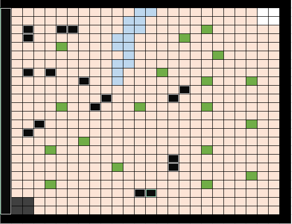
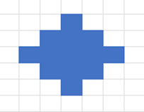
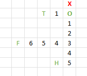

# Chess adventures

# Ландшафт

4 Стартовые клетки \- изначально перманентные(подробнее раздел “Захваты”) клетки где находятся персонажи на старте игры  
Камни (Скалы) \- участок карты куда нельзя зайти.  
Река \- одна клетка прохода по реке стоит 2 очка хода(на речной участок 2 клетки, нужно потратить 4 очка хода).  
Деревья:  
можно срубить, потратив один кубик меньшей стоимости(т.к. бросаются два кубика, например 6 и 2, ходят только за счет кубика 6, 2 пропускается).  
Можно посадить на своей территории приватизировав территорию вокруг него.

Секреты

1. бафф (увеличение характеристики)  
2. дебафф (уменьшение характеристики)  
3. бафф \+ дебафф  
4. телепорт (перемещение персонажа на любую клетку)  
5. лечение (персонаж лечится)  
6. яд (персонаж получает урон)  
7. лагерь (ставится костер, в радиусе 3 приватизируется территория, может лечить союзных персонажей)

\! Если выпадает джокер достается еще одна карта.

Карта (24 x 24\)  

# Захват территории

**Ключевые слова**

1. Захваченная клетка (может быть перехвачена противником)  
2. Перманентно захваченная клетка (не может быть перехвачена)

Побеждает тот кто захватил определенное количество территории (по договоренности).

**Обычный захват клетки**  
Для захвата клеток тратятся Очки захвата (дополнительная информация в Характеристиках). При перемещении персонажа по карте если клетка не была захвачена, либо была захвачена противником (не перманентно), то тратиться одно очко захвата на одну клетку.   
Захваченная клетка помечается жетоном своего цвета: обычный захват \- светлый, перманентный \- темный (если цвет зеленый, то светло-зеленый, темно-зеленый).

**Перманентный захват клетки**  
Клетка захватывается перманентно (на нее не может наступить противник, обязательно должно быть место для прохода противника на другую сторону):

* после битвы 

Победитель забирает территорию вокруг клетки зачинщика битвы в виде ромба, радис выбирается броском D6.   
\! Если вы не смогли победить монстра территория остается нейтральной  
	Пример (на кубике выпало число 3\)  

* при срубании дерева

Можно посадить это дерево на своей территории, это сделает зону радиусом 2 перманентной, и противник не может его срубить (если в приватизацию попадает нейтральная территория, она тоже приватизируется).

* Установка лагеря (можно получить из секретов).

# Движение

Каждый ход игроками бросаются 2 кубика D6. По договоренности можно бросать 4 кубика или 2 раза по 2 кубика, чтобы за ход двигать 4 персонажа.  
Одним кубиком можно ходить одним персонажем.  
Персонажи могут передвигаться строго по горизонтали и вертикали, не по диагонали.

В случае если срубается дерево, персонаж который срубает дерево, пропускает ход.

Когда персонаж подходит вплотную к вражескому персонажу, либо монстру начинается битва.

При попадании на нейтральную или захваченную территорию, она захватывается, тратя очки захвата персонажа.

# Характеристики (карты 52\)

| Название статы | Масть | Описание |
| ----- | ----- | ----- |
| Хп | черви | на листке выглядят как сердечки |
| Очки захвата | буби | сколько какой персонаж может захватить территории |
| Атака | крести | 1 атака \- 1 сердечко На листке как жетон ( или еще как) |
| Защита | вини | Пока есть тратиться вместо очков здоровья |
|  | красный джокер | воскрешает персонажа во время битвы |
|  | черный джокер | убивает вражеского персонажа во время битвы, либо наносит урон монстру равный половине его здоровья |

Получение характеристик

1. Сруб дерева (1 карта)  
2. Дубль костей (1 карта)  
3. Монстры (1-3 карты)  
4. Побежденные противники(2 карты)

# Битва

**Подготовка**  
В битве участвуют все персонажи.  
Они собираются по очереди от самого ближнего, к дальнему. Расстояние рассчитывается суммой клеток по горизонтали и вертикали относительно самого ближнего к противнику персонажа.  
Пример от самого ближнего O до самого дальнего F расстояние 6 клеток.  
 

таким образом, персонажи соберутся в очередь

1. O  
2. T  
3. H  
4. F

\! Если расстояние одинаковое, то первым ставится тот кого начали раньше считать.

**Ход битвы**  
Первый ход за инициатором битвы.  
Бросается D6, ход делается персонажем число которого выпало, если такого нет, ход переходит к оппоненту.  
Если же такой есть крутится колесо битвы (можно использовать D4) где может выпасть:

1. Атака прошла  
2. Атака заблокирована  
3. Противник контратаковал  
4. Нанесение критического урона (если выпало \- бросается D20 и урон рассчитывается по формуле “атака \+ 5 \* выпавшее число% от атаки”)  
5. Попадание в уязвимую зону (если выпало, то наносится урон только по хп, по защите нет)

если у персонажа заканчивается здоровье он погибает.

**Конец битвы**  
Выжившие персонажи остаются на тех местах где были перед битвой.

Умершие персонажи перемещаются на стартовые ячейки, характеристики сбрасываются к их изначальному значению, предметы телепорт и лагерь остаются при них.

# Бедствия (не обязательно)

Карта делится на четверти в какой-то четверти каждые 40 ходов на 20 ходов появляется бедствие, какое это бедствие выбирается кубиком

1. **Спокойное время**  
2. **Багровая ночь** 

В багровую ночь покидать пределы государственных границ крайне опасно- за один ход в пределах зоны бедствия у каждого персонажа отнимается по 1 хр и он ослабевает на 1 ед. Атаки. Монстры становятся вдвое сильнее обычного.   
Все полученные усиления и преимущества в багровую ночь удваиваются.

3. **Заморозки**

Персонажи замерзают теряется 2 очка хода с кубика для замерзшего персонажа.

4. **Пожар**

Персонаж находящийся в зоне теряет 1 хп каждый бросок кубиков.

5. **Песчаная буря**

У персонажей ограничен обзор, поэтому они могут заблудиться.  
Для персонажа ход делает и игрок и противник по очереди по одной клетке.  
Например, выпало 4 \-\> последовательность: 

1. Владелец подвинул на одну клетку  
2. Противник подвинул на одну клетку  
3. Владелец подвинул на одну клетку  
4. Противник подвинул на одну клетку